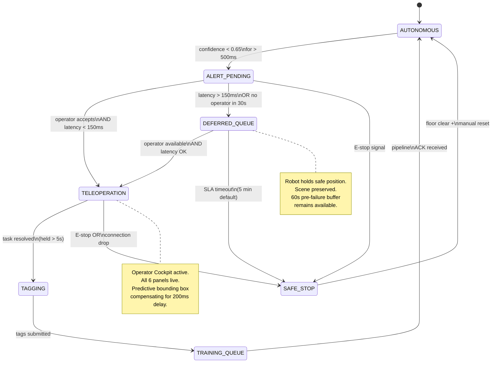

# APEX — Autonomous Policy Edge-Case and Recovery
## Product Requirements Document + Technical Execution Guide

[](https://github.com/vgandhi1/apex-recovery)
[](LICENSE)
[](https://react.dev/)
[](https://www.typescriptlang.org/)
[](https://zustand-demo.pmnd.rs/)

> **Project Type:** PM Strategy + Technical Prototype · **Stack:** React · TypeScript · Zustand · Recharts · WebSocket simulation  
> **Repo:** [vgandhi1/apex-recovery](https://github.com/vgandhi1/apex-recovery) · **Live demo:** https://vgandhi1.github.io/apex-recovery  
> **Portfolio context:** Standalone PM/product project. Episode metadata schema is compatible with downstream training pipeline infrastructure.  
> **Strategic purpose:** Prove you can take a vague AI research problem — "we need recovery data when the robot fails" — and deliver a concrete, buildable software specification that engineering can execute immediately.

---

## Table of Contents

1. [Executive Summary](#1-executive-summary)
2. [Problem Statement](#2-problem-statement)
3. [User Personas](#3-user-personas)
4. [Failure Taxonomy](#4-failure-taxonomy)
5. [State Machine Definition](#5-state-machine-definition)
6. [Hardware Constraints → UI Decision Log](#6-hardware-constraints--ui-decision-log)
7. [Feature Specification](#7-feature-specification)
8. [Operator Cockpit UI Specification](#8-operator-cockpit-ui-specification)
9. [Success Metrics & Acceptance Criteria](#9-success-metrics--acceptance-criteria)
10. [Episode Metadata Schema](#10-episode-metadata-schema)
11. [Technical Prototype Implementation](#11-technical-prototype-implementation)
12. [Out of Scope](#12-out-of-scope)
13. [Open Questions & Risks](#13-open-questions--risks)
14. [Appendix: Mermaid State Diagram](#14-appendix-mermaid-state-diagram)

---

## 1. Executive Summary

### The Business Problem

Robotics foundation model programs are collecting teleoperation data at scale, but the highest-value data — **recovery demonstrations**, where a human corrects a failing autonomous policy — is being systematically discarded or mislabeled. The current workflow when a robot fails:

1. Floor operator notices the robot is stuck
2. Operator physically walks to the station and hits E-stop
3. Robot is manually repositioned; episode is marked "FAILED" and discarded
4. **The recovery action itself — the most instructive signal for the AI — is never captured**

This represents a structural gap in every robotic learning program operating below the sophistication level of a top-5 research lab. The programs that close this gap first will compound model performance faster than programs that only train on successful episodes.

### The Proposed Solution

The **APEX (Autonomous Policy Edge-Case and Recovery)** platform is an end-to-end software system comprising:

- A **policy confidence monitoring layer** that detects impending failures before the robot hard-stops
- An **operator alert and handoff system** that routes the failing episode to the best-available teleoperator within latency constraints
- An **Operator Cockpit** — a browser-based UI with live telemetry, predictive visual compensation for camera lag, and a structured failure tagging system
- A **training data packaging pipeline** that outputs tagged recovery episodes in the exact schema consumed by the model training infrastructure

### Why This Matters Now

The ratio of "recovery demonstrations" to "successful demonstrations" in state-of-the-art VLA training datasets is typically 15–25% by design. Programs that cannot systematically generate this data must either (a) wait for researchers to manually author recovery scenarios, which is slow and artificial, or (b) run without recovery data, which limits policy robustness on the long tail of real-world conditions.

This product closes that gap on the data generation side.

---

## 2. Problem Statement

### Current State (As-Is)

```
Robot operating autonomously
        │
        ▼ [policy fails — grasp drops, confidence collapses, object moves]
        │
Floor supervisor notices (30–120 seconds later)
        │
        ▼ [manual E-stop, physical repositioning]
        │
Episode marked FAILED in MES log
        │
        ▼ [episode discarded during data audit]
        │
Training pipeline receives zero signal about what went wrong
or how a human would have recovered
```

**Data loss quantification:** In a typical 8-hour collection shift with a 15% failure rate, approximately 72 minutes of high-value recovery demonstrations are discarded per robot per shift. At 5 robots, that is **6 hours per shift** of the most instructive training signal simply never entering the data pipeline.

### Target State (To-Be)

```
Robot operating autonomously (confidence monitored at 10Hz)
        │
        ▼ [confidence drops below θ = 0.65 for >500ms]
        │
ALERT generated → operator routing algorithm selects best-available operator
        │
        ├─[latency OK, operator available]──────────────────────────────┐
        │                                                               ▼
        │                                               Operator Cockpit opens
        │                                               Operator takes haptic control
        │                                               Task is resolved
        │                                               Failure mode tagged
        │                                               Episode packaged → training queue
        │
        └─[latency too high OR no operator available]
                │
                ▼
        DEFERRED_QUEUE: robot holds safe position
        Episode queued for next available operator
        SLA timer starts (configurable: default 5 minutes)
```

### Problem Scope

This PRD covers the **software system** from confidence-drop event to training-queue submission. It does **not** cover:
- The underlying robot policy or confidence score generation
- Physical haptic hardware selection or procurement
- Network infrastructure (assumed: NATS JetStream on LAN, WebSocket to operator browser)
- Model training pipeline internals (schema contract defined here; pipeline implementation out of scope)

---

## 3. User Personas

### Persona 1 — The Teleoperator ("Operator")

| Attribute | Detail |
|---|---|
| **Role** | Full-time teleoperation specialist; runs 4–6 intervention sessions per shift |
| **Environment** | Control room or remote workstation; VR headset optional but not required |
| **Technical literacy** | Proficient with teleoperation hardware; not a software engineer |
| **Primary goal** | Resolve the robot's task quickly and correctly so the collection shift stays on schedule |
| **Secondary goal** | Tag the failure accurately so the AI team can improve the policy |
| **Key frustration** | Being alerted to a robot failure when their current latency is 180ms — they can't safely take over, but the system doesn't tell them why the handoff should be declined |
| **Success for this persona** | Clear alert, one-click takeover, visual compensation for camera lag, simple tagging, fast return-to-autonomy confirmation |

### Persona 2 — The Data Operations Manager ("Ops Lead")

| Attribute | Detail |
|---|---|
| **Role** | Manages the collection program; owns the episode quality KPIs |
| **Environment** | Desktop dashboard; reviews shift summaries and recovery statistics |
| **Primary goal** | Maximize high-quality recovery episodes per shift; minimize episodes lost to deferred queue timeout |
| **Key questions** | What failure types are most common this week? Which operators have the highest recovery quality scores? Is the policy improving on previously-tagged failure modes? |
| **Success for this persona** | Recovery episode count and quality trend upward week-over-week; deferred queue timeout rate below 5% |

### Persona 3 — The ML Research Engineer ("Researcher")

| Attribute | Detail |
|---|---|
| **Role** | Designs and trains robot policies; consumes recovery episode data |
| **Primary goal** | Receive well-labeled, high-quality recovery demonstrations on the specific failure modes the policy struggles with |
| **Key requirement** | Structured failure taxonomy in episode metadata — not free-text notes, but standardized tags that map directly to training curriculum categories |
| **Success for this persona** | Can filter training dataset by `failure_type`, `recovery_complexity`, and `operator_quality_score` without writing custom parsing logic |

---

## 4. Failure Taxonomy

This taxonomy is the semantic foundation of the entire product. Every alert, tag, routing decision, and training label derives from it. It must be defined before any UI work begins.

### Primary Failure Categories

| Code | Name | Description | Confidence Pattern | Recovery Complexity | Training Data Value |
|---|---|---|---|---|---|
| `GRASP_FAIL` | Grasp Failure | Object slips, drops, or was never acquired | Sharp drop after contact phase | Low — single reattempt | High — gripper force edge case |
| `SCENE_OCCL` | Scene Occlusion | Target object obscured by another object | Gradual decline during approach | Medium — robot reposition | Medium — spatial planning |
| `OBJ_NOVEL` | Novel Object | Out-of-distribution geometry or material | Slow decline, high variance | High — full teleoperation | Very High — OOD episode |
| `LIGHTING` | Lighting Change | Sudden illumination shift degrades vision | Spike then decline | Low — wait or adjust | Medium — perception robustness |
| `POSE_LIMIT` | Kinematic Limit | Joint configuration near workspace boundary | Moderate, sustained decline | Medium — trajectory replanning | Low — already modeled |
| `COLLAB_CONFLICT` | Collaborative Conflict | Another robot or human enters the workspace | Rapid drop with recovery | High — dynamic scene | High — multi-agent |
| `ESTOP` | Emergency Stop | Safety zone breach; physical intervention required | N/A — hard stop | Critical — floor personnel | Low — not trainable |
| `UNKNOWN` | Unknown / Unclassified | Operator cannot identify failure root cause | Any | Variable | Very High — novel failure mode |

### Secondary Tags (Applied in Addition to Primary)

These provide richer labeling for the ML researcher:

- `regrasp_required` — operator had to attempt grasp more than once
- `trajectory_modified` — operator's recovery path differed significantly from nominal
- `environment_altered` — workspace changed between failure and recovery (object moved, obstacle appeared)
- `policy_near_recovery` — autonomous policy was close to recovering; minimal human input needed
- `high_latency_compensated` — operator successfully recovered despite latency > 100ms (rare; valuable)
- `haptic_feedback_critical` — operator explicitly required haptic force feedback to resolve

---

## 5. State Machine Definition

### States

| State | Description | Entry Condition | Exit Conditions |
|---|---|---|---|
| `AUTONOMOUS` | Robot executing policy normally | System start; return from `TRAINING_QUEUE` | Confidence < θ for > 500ms |
| `ALERT_PENDING` | Failure detected; finding available operator | Enter from `AUTONOMOUS` | Operator accepts; latency violation; no operator; timeout |
| `TELEOPERATION` | Human has active control | Operator accepts handoff | Task resolved; E-stop; operator drops connection |
| `SAFE_STOP` | Robot halted in safe configuration | E-stop; critical failure; operator drop | Floor personnel clear; manual reset |
| `DEFERRED_QUEUE` | Episode queued; robot holding safe pose | Latency violation or no operator available | Operator becomes available; SLA timeout |
| `TAGGING` | Episode resolved; operator adding metadata | Task resolved in `TELEOPERATION` | Tags submitted |
| `TRAINING_QUEUE` | Episode packaged; awaiting ingestion | Tags submitted | Training pipeline ingests episode |

### Transitions

```
AUTONOMOUS
  ──[confidence < 0.65 sustained 500ms]──────────────→ ALERT_PENDING

ALERT_PENDING
  ──[operator accepts AND latency < 150ms]────────────→ TELEOPERATION
  ──[latency > 150ms OR no operator in 30s]───────────→ DEFERRED_QUEUE
  ──[E-stop signal received]──────────────────────────→ SAFE_STOP

TELEOPERATION
  ──[operator signals task resolved]──────────────────→ TAGGING
  ──[E-stop triggered]────────────────────────────────→ SAFE_STOP
  ──[operator connection drops]───────────────────────→ SAFE_STOP

SAFE_STOP
  ──[floor personnel acknowledge + manual reset]───────→ AUTONOMOUS

DEFERRED_QUEUE
  ──[operator available, latency OK]──────────────────→ TELEOPERATION
  ──[SLA timeout (5 min default)]─────────────────────→ SAFE_STOP (escalate)

TAGGING
  ──[operator submits tags]───────────────────────────→ TRAINING_QUEUE

TRAINING_QUEUE
  ──[training pipeline ACKs ingestion]────────────────→ AUTONOMOUS
```

### Critical Design Decision: The DEFERRED_QUEUE State

Most operator handoff systems treat "no available operator" as an error condition and trigger an E-stop. This is the wrong behavior for a data collection program because:

1. E-stop discards the partially-captured episode, including the failure moment itself
2. It creates a feedback loop where the most common failure modes (which are also the hardest, requiring the best operators) are also the least likely to be captured
3. It burns operator time on physical reset rather than teleoperation

`DEFERRED_QUEUE` solves this by holding the robot in a safe configuration with the scene preserved. The failure moment and pre-failure trajectory are buffered in NATS JetStream. When an operator becomes available (or latency improves), the full episode — including the failure — is presented for recovery. The operator sees the failure in context, not just the aftermath.

**SLA definition:** If no operator is available within 5 minutes (configurable), escalate to `SAFE_STOP` to avoid indefinite floor blockage.

---

## 6. Hardware Constraints → UI Decision Log

This section is the technical core of the PRD. Each row traces a physical constraint to a specific, justified product decision. This is the section that separates a PM who understands systems from one who draws boxes in Figma.

### Decision Log

| # | Hardware Constraint | Measured Value | Why It Matters | Product Decision | UI Implementation |
|---|---|---|---|---|---|
| 1 | Camera streaming delay | 180–220ms (720p H.264 over LAN) | Operator reacts to a world that is 200ms in the past; grabbing a moving object will fail | Show a **predictive bounding box** extrapolated from the last 10 robot velocity samples | Overlay on camera feed canvas; box drawn 200ms ahead of tracked object position |
| 2 | Haptic controller round-trip latency | 60–90ms on LAN, 120–200ms on WAN | Operator cannot rely on force feedback for precision grasping over WAN | **Block handoff if latency > 150ms**; display real-time latency with color threshold | Latency badge: green < 80ms, yellow 80–150ms, red > 150ms; handoff button disabled in red state |
| 3 | Force sensor sample rate | 1kHz raw, 50ms telemetry batch | Displaying raw 1kHz data in browser is meaningless noise; batching creates lag perception | Show **500ms rolling average force graph**, not raw samples | Recharts line chart, 10-point rolling window, updated every 50ms |
| 4 | NATS JetStream message delivery | < 5ms p99 on LAN | State updates can be event-driven without polling | **All UI state is WebSocket-push, zero polling** | Single WebSocket connection to NATS bridge; state transitions render < 10ms after event |
| 5 | VR headset tracking latency | 20–30ms (Quest 3) | Acceptable for body movement; marginal for fine manipulation | VR is **optional enhancement**, not required for handoff | Cockpit works in 2D browser; VR deeplink available if headset detected |
| 6 | Camera field of view | 90° horizontal (standard wrist cam) | Narrow FOV means operator cannot see full workspace context | Add **mini-map panel** showing robot position relative to full workspace | SVG overhead schematic; robot position updated from joint state |
| 7 | Robot safe-stop reaction time | 150–300ms from software command | Operator clicking "E-stop" in browser does not stop the robot instantly | Show **"Stopping..." animation** for 300ms after E-stop click; prevent any other commands | Button enters loading state; all other controls disabled until stop confirmed |
| 8 | Episode buffer storage | NATS FileStorage, 512MB per edge node | Cannot buffer unlimited pre-failure history | Buffer **last 60 seconds** of pre-failure trajectory; discard older | Session start shows buffered history indicator; operator knows how much context they have |

### Why This Section Exists in the PRD

These decisions are not obvious to a designer or a junior PM. They require understanding:
- What H.264 streaming latency actually looks like end-to-end (not just codec delay)
- Why a 1kHz sensor should not be displayed at 1kHz in a browser
- That "E-stop" in software and "E-stop" on the robot are different events with different latencies

By making these explicit in the PRD, the author signals to engineering that:
1. They will not be surprised by hardware limitations in implementation
2. The UI specification already accounts for the constraints; implementation does not require PM re-involvement
3. The tradeoffs have been thought through and are documented (avoiding re-debate in design reviews)

---

## 7. Feature Specification

### Feature 1 — Confidence Monitoring & Alert Generation

**Description:** The policy inference service publishes a `confidence_score` field with each action output at 10Hz. A monitoring sidecar consumes this stream and emits a `RECOVERY_ALERT` event when the score drops below threshold.

**Inputs:**
- `confidence_score` (float, 0.0–1.0) from policy inference at 10Hz
- `robot_state` (joint positions, velocity, force readings) at 20Hz

**Alert trigger logic:**
```python
# Pseudocode — implemented in policy monitoring sidecar
CONFIDENCE_THRESHOLD = 0.65
SUSTAINED_WINDOW_MS = 500

def check_alert_condition(confidence_buffer: deque) -> bool:
    """
    Trigger alert only if confidence has been below threshold
    for a sustained window — prevents spurious alerts from
    momentary fluctuations during normal manipulation.
    """
    window_samples = [
        c for c in confidence_buffer
        if c['timestamp'] > (now() - SUSTAINED_WINDOW_MS)
    ]
    if len(window_samples) < 3:
        return False
    return all(s['value'] < CONFIDENCE_THRESHOLD for s in window_samples)
```

**Output event schema:**
```json
{
  "event_type": "RECOVERY_ALERT",
  "episode_id": "REC_00247",
  "robot_id": "ROBOT_03",
  "timestamp_utc": "2026-05-13T14:32:11.423Z",
  "confidence_at_alert": 0.58,
  "confidence_trend": "declining",
  "pre_failure_buffer_seconds": 60,
  "task_type": "assembly",
  "suggested_failure_type": "GRASP_FAIL",
  "suggested_confidence": 0.72
}
```

**`suggested_failure_type`** is a lightweight classifier output (trained on historical failure patterns) that pre-fills the operator's tagging form. This reduces tagging time from ~20 seconds to ~5 seconds. Operator can override.

> **V1 / V2 note:** In V1, this classifier field is populated by a small, separately maintained model owned by the Data Ops team — not the core VLA policy. If the classifier is not yet trained or validated at launch, `suggested_failure_type` defaults to `null` and the operator selects the failure type manually from the dropdown. The tagging form is designed to support both flows without UI changes; the pre-fill is an enhancement, not a dependency.

---

### Feature 2 — Operator Routing

**Description:** When a `RECOVERY_ALERT` fires, the routing system selects the best available operator based on three criteria in priority order.

**Routing algorithm:**
```
1. Filter: operator_status == AVAILABLE
2. Filter: current_latency_ms < 150
3. Filter: current_active_sessions < 1  (no concurrent sessions)
4. Score:  (skill_match_score * 0.5) + (queue_depth_score * 0.3) + (latency_score * 0.2)
5. Select: highest score; alert that operator first
6. Timeout: if no acceptance in 30s, try next candidate
7. Fallback: if no candidates, push to DEFERRED_QUEUE
```

**Skill match score:** Operators are tagged with `specialized_task_types[]`. An operator specialized in assembly tasks scores 1.0 for an assembly failure; generalists score 0.7.

**Queue depth score:** Operators with shorter pending-review queues score higher — prevents stacking unreviewed episodes with one operator.

---

### Feature 3 — Operator Cockpit

Fully specified in Section 8.

---

### Feature 4 — Failure Tagging System

**Description:** After task resolution, the operator is presented with a structured tagging form before the episode is submitted to the training queue. The form is pre-filled by the suggested failure classifier.

**Design principles:**
- **Maximum 4 clicks** to submit a fully tagged episode
- Pre-filled suggestion visible immediately; operator confirms or overrides
- Secondary tags available as a scrollable chip list; no typing required
- Free-text "notes" field is optional and placed last — operators should not be required to type

**Tagging form fields:**

| Field | Type | Required | Pre-filled? |
|---|---|---|---|
| `failure_type` | Single select (taxonomy) | Yes | Yes — from classifier |
| `secondary_tags` | Multi-select chips | No | No |
| `recovery_quality` | 1–5 star self-assessment | Yes | No |
| `policy_was_close` | Boolean toggle | No | No |
| `notes` | Free text, max 280 chars | No | No |

---

### Feature 5 — Training Data Packaging

**Description:** On tag submission, the system assembles the complete episode package and publishes it to the training queue topic.

See Section 10 for the full schema.

---

## 8. Operator Cockpit UI Specification

### Layout Overview

The cockpit is a single-page browser application optimized for 1920×1080 (primary) and 1440×900 (secondary). It is designed for keyboard + mouse; VR mode is an optional deeplink.

```
┌─────────────────────────────────────────────────────────────────────────────┐
│  HEADER BAR                                                                 │
│  [Robot ID] [Episode ID] [STATE: TELEOPERATION]  [⏱ 00:34]  [LATENCY 82ms] │
├──────────────────────────────────────┬──────────────────────────────────────┤
│                                      │  TELEMETRY PANEL                    │
│   PRIMARY CAMERA FEED                │  ┌──────────────────────────────┐   │
│   (canvas with overlay)              │  │ Confidence Score (last 30s)  │   │
│                                      │  │ [recharts line — threshold]  │   │
│   [predictive bounding box]          │  └──────────────────────────────┘   │
│   [object track lines]               │  ┌──────────────────────────────┐   │
│                                      │  │ Force Reading (500ms rolling) │   │
│                                      │  │ [recharts area chart]        │   │
│                                      │  └──────────────────────────────┘   │
│                                      │  ┌──────────────────────────────┐   │
│                                      │  │ MINI-MAP (workspace overhead) │   │
│                                      │  │ [SVG — robot position dot]   │   │
│                                      │  └──────────────────────────────┘   │
├──────────────────────────────────────┼──────────────────────────────────────┤
│  CONTROL BAR                         │  PRE-FAILURE CONTEXT               │
│  [HAPTIC ON/OFF] [CAMERA: WRIST/EXT] │  "Failure detected 34s ago"        │
│  [E-STOP 🔴]  [TASK RESOLVED ✅]     │  "Confidence: 0.58 → 0.51 → 0.48"  │
│                                      │  "Suggested: GRASP_FAIL (72%)"     │
└──────────────────────────────────────┴──────────────────────────────────────┘
```

### Panel Specifications

#### Panel 1 — Primary Camera Feed

- **Source:** WebRTC or MJPEG stream from robot wrist camera
- **Resolution:** 720p displayed at native or scaled to fit panel
- **Overlays (rendered on canvas, not on video element):**
  - **Predictive bounding box:** Yellow dashed rectangle, extrapolated 200ms ahead of tracked object using last 10 velocity samples. Labeled "Predicted position (+200ms)"
  - **Object track lines:** Thin white trails showing object trajectory over last 2 seconds
  - **Latency watermark:** Bottom-right corner shows streaming delay in small gray text. Not a warning — purely informational context.
- **Camera toggle:** Switch between wrist camera (default) and external workspace camera. Toggle remembers per-session preference.

#### Panel 2 — Confidence Score Chart

- **Type:** Recharts `LineChart` with `ReferenceLine` at threshold (0.65)
- **Window:** Last 30 seconds of data, auto-scrolling
- **Colors:** Line is green above threshold, transitions to red below
- **Annotation:** Point marker at the exact moment `RECOVERY_ALERT` fired
- **Why 30 seconds:** Shows the operator the trend leading into the failure, not just the current value. Context for tagging decision.

#### Panel 3 — Force Reading Chart

- **Type:** Recharts `AreaChart`, 500ms rolling average
- **Window:** Last 10 seconds
- **Upper threshold line:** Max safe grip force (configurable per robot)
- **Purpose:** Lets operator calibrate their haptic inputs to actual applied force. Prevents overtorquing during recovery.

#### Panel 4 — Mini-Map

- **Type:** SVG overhead schematic of the workspace
- **Elements:**
  - Robot arm base (fixed circle)
  - End-effector current position (filled dot, updates at 10Hz)
  - Target object position (if known from vision system)
  - Workspace boundary (workspace limits derived from URDF)
  - No-go zones (configured per deployment)
- **Purpose:** Orients operator spatially. The primary camera feed is first-person; the mini-map provides global context.

#### Panel 5 — Control Bar

| Control | Type | Behavior |
|---|---|---|
| **HAPTIC ON/OFF** | Toggle | Enables/disables haptic force feedback to controller; default ON |
| **CAMERA** | Segmented control | WRIST / EXTERNAL; switches primary feed source |
| **E-STOP** | Red button with hold-to-confirm (1.5s) | Sends safe-stop command; button requires hold to prevent accidental activation |
| **TASK RESOLVED** | Green button | Transitions state to `TAGGING`; disabled until operator has been in TELEOPERATION for > 5 seconds (prevents premature submission) |

**E-Stop hold-to-confirm rationale:** In high-stress recovery situations, operators may click E-stop impulsively when they momentarily lose orientation. A 1.5-second hold creates a mandatory pause that reduces accidental stops without meaningfully delaying a real emergency stop.

#### Panel 6 — Pre-Failure Context

A read-only panel showing the operator the failure narrative:
- Time since failure detected
- Confidence score trajectory at failure moment (text summary: "0.58 → 0.51 → 0.48")
- Classifier-suggested failure type with confidence percentage
- Pre-failure buffer availability ("60 seconds of pre-failure trajectory available")

This panel is the difference between an operator who understands *why* they were called in and one who is dropped into a scene with no context. The latter makes worse recovery decisions and worse tagging decisions.

---

### Tagging Modal (Post-Resolution)

Appears after operator clicks "TASK RESOLVED." Full-screen overlay to ensure focus.

```
┌────────────────────────────────────────────────────────┐
│  TAG THIS RECOVERY EPISODE                             │
│  Episode REC_00247 · Assembly · Duration: 34s          │
│                                                        │
│  PRIMARY FAILURE TYPE                                  │
│  ┌──────────────────────────────────────────────────┐  │
│  │ ● GRASP_FAIL (suggested, 72% confidence)         │  │
│  │ ○ SCENE_OCCLUSION                                │  │
│  │ ○ NOVEL_OBJECT                                   │  │
│  │ ○ LIGHTING_CHANGE                                │  │
│  │ ○ POSE_LIMIT                                     │  │
│  │ ○ UNKNOWN                                        │  │
│  └──────────────────────────────────────────────────┘  │
│                                                        │
│  SECONDARY TAGS  (optional)                            │
│  [regrasp_required] [trajectory_modified]              │
│  [high_latency_compensated] [haptic_feedback_critical] │
│                                                        │
│  HOW WELL DID YOU RECOVER THIS?                        │
│  ★ ★ ★ ★ ☆  (4/5)                                     │
│                                                        │
│  WAS THE POLICY ALMOST RECOVERING ON ITS OWN?  [No ▾] │
│                                                        │
│  NOTES (optional)  ──────────────────────────────────  │
│  [                                           ] 0/280   │
│                                                        │
│  [SUBMIT EPISODE →]                                    │
└────────────────────────────────────────────────────────┘
```

---

## 9. Success Metrics & Acceptance Criteria

### North Star Metric

**Recovery Episode Capture Rate:** Percentage of robot failures that result in a tagged recovery episode entering the training queue.

- **Baseline (current):** ~0% (episodes are discarded)
- **30-day target:** > 70%
- **90-day target:** > 85%

### Supporting Metrics

| Metric | Definition | Target | Measurement |
|---|---|---|---|
| **Operator Accept Rate** | % of ALERT_PENDING that result in accepted handoffs (not routed to DEFERRED_QUEUE) | > 80% | State machine event log |
| **Latency Violation Rate** | % of alerts blocked by latency > 150ms | < 15% | Alert routing log |
| **Tagging Completion Rate** | % of TELEOPERATION sessions that reach TRAINING_QUEUE (not abandoned) | > 95% | State machine event log |
| **Tagging Time** | Time from TASK_RESOLVED to episode submission | < 30 seconds median | Session timing |
| **Deferred Queue Timeout Rate** | % of DEFERRED_QUEUE entries that hit SLA timeout | < 5% | Queue event log |
| **Operator Quality Score** | Weighted avg of self-assessed recovery quality per operator | > 3.5 / 5.0 | Episode metadata |
| **Pre-fill Override Rate** | % of suggested failure types overridden by operator | < 30% (target accuracy of classifier) | Tagging log |

### Definition of Done (Engineering Acceptance)

- [ ] State machine transitions are logged as structured events to the telemetry pipeline
- [ ] `DEFERRED_QUEUE` path is tested with simulated latency violations (Toxiproxy)
- [ ] Cockpit loads within 2 seconds of `RECOVERY_ALERT` event on LAN
- [ ] E-stop hold-to-confirm completes within 1.5 seconds and logs to safety event log
- [ ] Tagged episode is published to training queue within 5 seconds of submission
- [ ] Predictive bounding box renders without visible lag on 1920×1080 canvas at 30fps
- [ ] All state transitions testable via documented API endpoints (for QA automation)

---

## 10. Episode Metadata Schema

This is the contract between this product and the ML training pipeline. It must be stable and versioned.

### Schema Version 1.0

```json
{
  "$schema": "https://schema.robotics.internal/recovery-episode/v1.0.json",
  "schema_version": "1.0",

  "episode": {
    "episode_id": "REC_00247",
    "robot_id": "ROBOT_03",
    "collection_site": "normal-il-factory-01",
    "task_type": "assembly",
    "nominal_policy_id": "vla-v2.3-assembly",
    "episode_start_utc": "2026-05-13T14:31:37.000Z",
    "failure_detected_utc": "2026-05-13T14:32:11.423Z",
    "recovery_start_utc": "2026-05-13T14:32:18.901Z",
    "recovery_end_utc": "2026-05-13T14:32:52.104Z",
    "episode_end_utc": "2026-05-13T14:33:01.200Z"
  },

  "failure": {
    "failure_type": "GRASP_FAIL",
    "failure_type_source": "operator",
    "classifier_suggestion": "GRASP_FAIL",
    "classifier_confidence": 0.72,
    "confidence_at_alert": 0.58,
    "confidence_trend_5s": [0.82, 0.74, 0.66, 0.61, 0.58],
    "secondary_tags": ["regrasp_required"],
    "pre_failure_buffer_seconds": 60
  },

  "recovery": {
    "operator_id": "OP_007",
    "operator_latency_ms": 82,
    "recovery_duration_seconds": 33.2,
    "haptic_feedback_used": true,
    "camera_mode_used": "wrist",
    "estop_triggered": false,
    "recovery_quality_self_assessed": 4,
    "policy_was_near_recovery": false,
    "notes": null
  },

  "data_quality": {
    "data_quality_score": 87,
    "training_priority": "high",
    "usable_for_training": true,
    "exclusion_reason": null
  },

  "routing": {
    "alert_to_accept_seconds": 7.5,
    "deferred_queue_time_seconds": 0,
    "operators_alerted_before_accept": 1
  },

  "artifacts": {
    "video_wrist_uri": "s3://training-data/recovery/REC_00247/wrist.mp4",
    "video_external_uri": "s3://training-data/recovery/REC_00247/external.mp4",
    "trajectory_uri": "s3://training-data/recovery/REC_00247/trajectory.npy",
    "force_log_uri": "s3://training-data/recovery/REC_00247/force.csv"
  }
}
```

### Schema Design Decisions

**`failure_type_source`:** Distinguishes between `operator` (human tagged) and `classifier` (auto-tagged, operator didn't override). The ML researcher filters on this when they want ground-truth-only labels for evaluation sets.

**`confidence_trend_5s`:** Includes the 5-second confidence trajectory leading to the alert. The ML team uses this to train the alert-trigger classifier on new policy versions. This field is what closes the self-improvement loop.

**`data_quality_score`:** Same 0–100 metric used in the TeleOp Flywheel Dashboard (computed from operator latency, recovery quality self-assessment, and tagging completeness). Enables the Ops Lead to filter training data by quality without writing custom logic.

**`training_priority`:** Derived from `failure_type` rarity and `operator_latency_ms`. `OBJ_NOVEL` failures with low operator latency are always `priority: very_high`. This field pre-seeds the training curriculum scheduler.

---

## 11. Technical Prototype Implementation

### What to Build

The portfolio-quality implementation of this PRD is a **React/TypeScript Operator Cockpit simulator** deployed to GitHub Pages. It must:

1. Simulate the state machine with realistic transitions
2. Render all six cockpit panels with live (simulated) data
3. Implement the DEFERRED_QUEUE path — demonstrate it works by clicking "simulate high latency"
4. Complete the tagging flow and output valid JSON matching the schema in Section 10
5. Export the tagged episode JSON (downloadable file) — this is the interview artifact

### Technology Stack

```
React 18 + TypeScript          → Component framework
Zustand                         → State machine state store
Recharts                        → Confidence score + force charts
Canvas API (React ref)          → Camera feed + bounding box overlay
Tailwind CSS                    → Layout and styling
WebSocket (simulated)           → Event-driven state updates (mock server)
```

### Repository Structure

```
apex-recovery/                      # github.com/vgandhi1/apex-recovery
├── README.md                       # Project overview, live demo link, PRD link
├── package.json
├── vite.config.ts                  # Vite + React build config
├── tailwind.config.ts
├── src/
│   ├── types/
│   │   ├── StateMachine.ts         # State machine types and transition map
│   │   ├── Episode.ts              # Episode metadata schema (TypeScript interface)
│   │   └── Telemetry.ts            # Robot telemetry types
│   ├── simulation/
│   │   ├── RobotSimulator.ts       # Generates synthetic robot state events
│   │   ├── ConfidenceModel.ts      # Simulates confidence score trajectory
│   │   └── LatencySimulator.ts     # Simulates network latency with jitter
│   ├── store/
│   │   └── cockpitStore.ts         # Zustand store: state machine + telemetry
│   ├── components/
│   │   ├── CameraFeed.tsx          # Canvas with predictive bounding box overlay
│   │   ├── ConfidenceChart.tsx     # Recharts confidence score with threshold line
│   │   ├── ForceChart.tsx          # Recharts force reading (500ms rolling avg)
│   │   ├── MiniMap.tsx             # SVG workspace overhead view
│   │   ├── ControlBar.tsx          # E-stop, haptic toggle, task resolved
│   │   ├── PreFailureContext.tsx   # Failure narrative panel
│   │   ├── TaggingModal.tsx        # Post-resolution tagging form
│   │   └── StateBanner.tsx         # Current state + latency header
│   ├── utils/
│   │   ├── dataQualityScore.ts     # Computes DQS from recovery metadata
│   │   └── episodePackager.ts      # Assembles final episode JSON from session data
│   └── App.tsx
├── public/
│   └── index.html
└── docs/
    ├── PRD.md                      # This document
    ├── state-machine.md            # State transition reference
    └── episode-schema.md           # Schema v1.0 field-level documentation
```

### Core State Machine Store (Zustand)

```typescript
// src/store/cockpitStore.ts

import { create } from 'zustand'
import { CockpitState, RecoveryState, TelemetryPoint } from '../types/StateMachine'

interface CockpitStore {
  // State machine
  recoveryState: RecoveryState
  episodeId: string
  robotId: string

  // Telemetry streams
  confidenceHistory: TelemetryPoint[]
  forceHistory: TelemetryPoint[]
  latencyMs: number
  robotPosition: { x: number; y: number; z: number }

  // Session metadata
  alertFiredAt: Date | null
  recoveryStartedAt: Date | null
  recoveryEndedAt: Date | null
  operatorId: string

  // Actions
  triggerAlert: () => void
  acceptHandoff: () => void
  simulateHighLatency: () => void
  resolveTask: () => void
  submitTags: (tags: TagSubmission) => void
  updateTelemetry: (point: TelemetryPoint) => void
}

export const useCockpitStore = create<CockpitStore>((set, get) => ({
  recoveryState: 'AUTONOMOUS',
  episodeId: `REC_${String(Math.floor(Math.random() * 99999)).padStart(5, '0')}`,
  robotId: 'ROBOT_03',
  confidenceHistory: [],
  forceHistory: [],
  latencyMs: 82,
  robotPosition: { x: 0.45, y: 0.12, z: 0.08 },
  alertFiredAt: null,
  recoveryStartedAt: null,
  recoveryEndedAt: null,
  operatorId: 'OP_007',

  triggerAlert: () => {
    set({
      recoveryState: 'ALERT_PENDING',
      alertFiredAt: new Date(),
    })
  },

  acceptHandoff: () => {
    const { latencyMs } = get()
    if (latencyMs > 150) {
      // Latency violation → DEFERRED_QUEUE
      set({ recoveryState: 'DEFERRED_QUEUE' })
    } else {
      set({
        recoveryState: 'TELEOPERATION',
        recoveryStartedAt: new Date(),
      })
    }
  },

  simulateHighLatency: () => {
    set({ latencyMs: 210 })
    // Restore after 10 seconds for demo purposes
    setTimeout(() => set({ latencyMs: 82 }), 10000)
  },

  resolveTask: () => {
    set({
      recoveryState: 'TAGGING',
      recoveryEndedAt: new Date(),
    })
  },

  submitTags: (tags) => {
    const state = get()
    const episode = buildEpisodePayload(state, tags)
    // In real implementation: POST to training pipeline
    // In prototype: trigger JSON download
    downloadEpisodeJSON(episode)
    set({ recoveryState: 'TRAINING_QUEUE' })
    // Reset to AUTONOMOUS after brief display
    setTimeout(() => set({ recoveryState: 'AUTONOMOUS' }), 3000)
  },

  updateTelemetry: (point) => {
    set((state) => ({
      confidenceHistory: [
        ...state.confidenceHistory.slice(-300), // Keep last 30s at 10Hz
        point,
      ],
    }))
  },
}))
```

### Camera Feed with Predictive Bounding Box

```typescript
// src/components/CameraFeed.tsx

import React, { useRef, useEffect } from 'react'

interface BoundingBox {
  x: number; y: number; width: number; height: number
}

interface Props {
  currentBox: BoundingBox
  velocityHistory: { vx: number; vy: number; timestamp: number }[]
  streamDelayMs: number
}

export const CameraFeed: React.FC<Props> = ({
  currentBox,
  velocityHistory,
  streamDelayMs = 200,
}) => {
  const canvasRef = useRef<HTMLCanvasElement>(null)

  // Compute predicted position based on average velocity over last 10 samples
  const predictPosition = (box: BoundingBox): BoundingBox => {
    if (velocityHistory.length < 3) return box

    const recent = velocityHistory.slice(-10)
    const avgVx = recent.reduce((s, v) => s + v.vx, 0) / recent.length
    const avgVy = recent.reduce((s, v) => s + v.vy, 0) / recent.length

    const delaySeconds = streamDelayMs / 1000
    return {
      x: box.x + (avgVx * delaySeconds),
      y: box.y + (avgVy * delaySeconds),
      width: box.width,
      height: box.height,
    }
  }

  useEffect(() => {
    const canvas = canvasRef.current
    if (!canvas) return
    const ctx = canvas.getContext('2d')
    if (!ctx) return

    // Draw simulated camera frame (gray gradient background for demo)
    const gradient = ctx.createLinearGradient(0, 0, canvas.width, canvas.height)
    gradient.addColorStop(0, '#1a1a2e')
    gradient.addColorStop(1, '#16213e')
    ctx.fillStyle = gradient
    ctx.fillRect(0, 0, canvas.width, canvas.height)

    // Draw current bounding box (white, solid)
    ctx.strokeStyle = 'rgba(255, 255, 255, 0.7)'
    ctx.lineWidth = 2
    ctx.setLineDash([])
    ctx.strokeRect(currentBox.x, currentBox.y, currentBox.width, currentBox.height)
    ctx.fillStyle = 'rgba(255, 255, 255, 0.1)'
    ctx.fillRect(currentBox.x, currentBox.y, currentBox.width, currentBox.height)

    // Draw predictive bounding box (yellow, dashed)
    const predicted = predictPosition(currentBox)
    ctx.strokeStyle = 'rgba(251, 191, 36, 0.9)'
    ctx.lineWidth = 2
    ctx.setLineDash([6, 4])
    ctx.strokeRect(predicted.x, predicted.y, predicted.width, predicted.height)

    // Label
    ctx.fillStyle = 'rgba(251, 191, 36, 0.9)'
    ctx.font = '11px monospace'
    ctx.setLineDash([])
    ctx.fillText(`Predicted +${streamDelayMs}ms`, predicted.x + 4, predicted.y - 6)

    // Arrow from current to predicted
    ctx.strokeStyle = 'rgba(251, 191, 36, 0.4)'
    ctx.lineWidth = 1
    ctx.setLineDash([3, 3])
    ctx.beginPath()
    ctx.moveTo(
      currentBox.x + currentBox.width / 2,
      currentBox.y + currentBox.height / 2
    )
    ctx.lineTo(
      predicted.x + predicted.width / 2,
      predicted.y + predicted.height / 2
    )
    ctx.stroke()

    // Latency watermark
    ctx.fillStyle = 'rgba(156, 163, 175, 0.5)'
    ctx.font = '10px monospace'
    ctx.setLineDash([])
    ctx.fillText(`stream delay: ${streamDelayMs}ms`, canvas.width - 130, canvas.height - 10)
  }, [currentBox, velocityHistory, streamDelayMs])

  return (
    <canvas
      ref={canvasRef}
      width={640}
      height={360}
      className="w-full rounded-lg bg-gray-900"
    />
  )
}
```

### Episode JSON Packager

```typescript
// src/utils/episodePackager.ts

import { CockpitStore } from '../store/cockpitStore'
import { TagSubmission } from '../types/StateMachine'

export function buildEpisodePayload(state: CockpitStore, tags: TagSubmission) {
  const recoveryDuration = state.recoveryEndedAt && state.recoveryStartedAt
    ? (state.recoveryEndedAt.getTime() - state.recoveryStartedAt.getTime()) / 1000
    : 0

  const latencyScore = Math.max(0, 100 - ((state.latencyMs - 50) * 1.0))
  const qualityScore = Math.round(
    (tags.recoveryQuality / 5 * 60) +
    (latencyScore * 0.3) +
    (tags.failureType !== 'UNKNOWN' ? 10 : 0)
  )

  return {
    schema_version: "1.0",
    episode: {
      episode_id: state.episodeId,
      robot_id: state.robotId,
      task_type: "assembly",
      failure_detected_utc: state.alertFiredAt?.toISOString(),
      recovery_start_utc: state.recoveryStartedAt?.toISOString(),
      recovery_end_utc: state.recoveryEndedAt?.toISOString(),
    },
    failure: {
      failure_type: tags.failureType,
      failure_type_source: tags.overriddenSuggestion ? 'operator' : 'classifier_confirmed',
      classifier_suggestion: tags.classifierSuggestion,
      classifier_confidence: tags.classifierConfidence,
      secondary_tags: tags.secondaryTags,
    },
    recovery: {
      operator_id: state.operatorId,
      operator_latency_ms: state.latencyMs,
      recovery_duration_seconds: Math.round(recoveryDuration * 10) / 10,
      haptic_feedback_used: tags.hapticUsed,
      recovery_quality_self_assessed: tags.recoveryQuality,
      policy_was_near_recovery: tags.policyNearRecovery,
      notes: tags.notes || null,
    },
    data_quality: {
      data_quality_score: qualityScore,
      training_priority: qualityScore >= 80 ? 'high' : qualityScore >= 60 ? 'medium' : 'low',
      usable_for_training: qualityScore >= 50 && tags.failureType !== 'ESTOP',
    },
  }
}

export function downloadEpisodeJSON(episode: object) {
  const blob = new Blob([JSON.stringify(episode, null, 2)], {
    type: 'application/json'
  })
  const url = URL.createObjectURL(blob)
  const a = document.createElement('a')
  a.href = url
  a.download = `${(episode as any).episode?.episode_id ?? 'episode'}.json`
  a.click()
  URL.revokeObjectURL(url)
}
```

### Running the Prototype

```bash
# Setup
git clone https://github.com/vgandhi1/apex-recovery.git
cd apex-recovery
npm install

# Development (Vite dev server)
npm run dev       # → http://localhost:5173

# Production build
npm run build

# Deploy to GitHub Pages (gh-pages package)
npm run deploy    # → https://vgandhi1.github.io/apex-recovery
```

### Demo Script (For Interviews)

When presenting the live demo:

1. **Open the app** → Show AUTONOMOUS state, confidence score bouncing around 0.80
2. **Click "Simulate Failure"** → Confidence drops; watch ALERT_PENDING state appear
3. **Click "Accept Handoff"** → Enter TELEOPERATION; all six panels go live
4. **Click "Simulate High Latency"** → Latency badge turns red; accept button disables
5. **Restore latency** → Button re-enables; explain DEFERRED_QUEUE path verbally
6. **Click "Task Resolved"** → Tagging modal opens; show pre-filled suggestion
7. **Submit tags** → JSON file downloads; open it; walk through schema fields
8. **State returns to AUTONOMOUS** → Full cycle complete

This demo runs in 3–4 minutes and touches every technical concept in the PRD.

---

## 12. Out of Scope

The following are explicitly excluded from this PRD to bound scope:

| Item | Reason for Exclusion |
|---|---|
| Haptic hardware selection | Hardware procurement decision; independent of software specification. The Cockpit UI accepts inputs from standard Gamepad API or WebHID; specific controller choice (6-DOF SpaceMouse, VR controller, kinesthetic rig) is a separate hardware evaluation outside this PRD |
| VR headset integration | Optional enhancement; cockpit is fully functional in 2D browser |
| Policy confidence score generation | Owned by the policy team; this PRD consumes the score as an input |
| Training pipeline internals | Separate system; the episode metadata schema in Section 10 is the interface contract — pipeline implementation is out of scope |
| Multi-robot simultaneous recovery | V2 feature; routing algorithm handles one-at-a-time in V1 |
| Operator pay/incentive system | HR/business decision outside product scope |
| Physical floor safety procedures | Governed by existing EHS protocols; out of software scope |

> **Note on downstream compatibility:** The episode metadata schema (Section 10) uses `operator_id`, `data_quality_score`, and `training_priority` field conventions consistent with the broader teleoperation data infrastructure. Any training pipeline or analytics platform consuming standard teleoperation episode data can ingest recovery episodes from this system without schema mapping.

---

## 13. Open Questions & Risks

### Open Questions

| # | Question | Owner | Due |
|---|---|---|---|
| OQ-1 | What is the exact confidence score field name in the policy inference output? | Policy team | Before Sprint 1 |
| OQ-2 | Is NATS JetStream available on the factory LAN, or do we need to deploy it? | Platform Infra | Before Sprint 1 |
| OQ-3 | What is the maximum acceptable deferred queue depth before floor ops becomes concerned? | Ops Lead | Before Sprint 2 |
| OQ-4 | Do operators need to view recovery episodes for quality review post-shift, or is tagging at time-of-recovery sufficient? | Data Ops | Before Sprint 2 |
| OQ-5 | Should `UNKNOWN` failure type episodes be auto-flagged for researcher review, or just enter the standard queue? | ML Research | Before Sprint 3 |

### Risks

| Risk | Likelihood | Impact | Mitigation |
|---|---|---|---|
| Operator latency consistently > 150ms on factory network | Medium | High — many handoffs deferred | Network audit before deployment; consider on-site operator station |
| Pre-fill classifier accuracy below 70% | Medium | Medium — operators override frequently; defeats time-saving goal | Evaluate classifier on 200 historical episodes before launch; set launch bar at 65% |
| Operators treat tagging as a burden; quality degrades over time | Medium | High — degrades training data value | Instrument tagging time per operator; gamify with leaderboard |
| DEFERRED_QUEUE fills faster than operators can clear it | Low | High — floor blockage | SLA alert to Ops Lead when queue depth > 5; auto-escalate |
| E-stop hold-to-confirm causes delay in genuine emergencies | Low | Critical | Audit with safety team; consider separate physical E-stop as primary |
| Predictive bounding box diverges on sudden direction changes | Medium | Medium — operator misjudges grasp position | V1 uses pixel-velocity linear extrapolation; if jitter is unacceptable in testing, fall back to extrapolating from the robot's planned joint trajectory via the ROS 2 TF tree, which reflects commanded motion rather than observed pixel motion |

---

## 14. Appendix: Mermaid State Diagram



---

## Document Metadata

| Field | Value |
|---|---|
| **Product name** | APEX — Autonomous Policy Edge-Case and Recovery |
| **Document version** | 1.0 |
| **Status** | Draft — ready for engineering review |
| **Author** | Vinay Gandhi |
| **Created** | May 2026 |
| **Related projects** | TeleOp Flywheel Dashboard (shared `operator_id` and `data_quality_score` field conventions) |

---

## GitHub Repository Metadata

**Repo:** `vgandhi1/apex-recovery`  
**URL:** https://github.com/vgandhi1/apex-recovery  
**Live demo:** https://vgandhi1.github.io/apex-recovery  
**Schema reference:** `src/types/Episode.ts`  

### Recommended GitHub About Description

```
Operator cockpit + PRD for autonomous robot failure recovery. 
State machine from confidence-drop → human teleoperation → tagged training episode. 
React/TypeScript prototype with predictive bounding box compensation for 200ms camera lag.
```

### Recommended GitHub Topics

```
robotics  teleop  human-in-the-loop  react  typescript  zustand  
product-management  prd  imitation-learning  vla  factory-automation  
edge-case  operator-cockpit  training-data
```

### Recommended README Structure (`README.md`)

```markdown
# APEX — Autonomous Policy Edge-Case and Recovery

[](https://vgandhi1.github.io/apex-recovery)
[](docs/PRD.md)
[](LICENSE)

> A PM-authored PRD + working React prototype for the human-in-the-loop 
> recovery workflow triggered when a robot's autonomous policy fails on the factory floor.

## What this proves
- Product strategy: vague research problem → concrete, buildable specification
- State machine design: 7-state recovery flow including DEFERRED_QUEUE fallback path
- Hardware-informed UI: every design decision traces to a measured hardware constraint
- Schema design: structured episode metadata contract for ML training pipeline consumption

## Live demo walkthrough (3 min)
1. Open the app → robot in AUTONOMOUS state, confidence ~0.80
2. Click **Simulate Failure** → confidence drops, ALERT_PENDING fires
3. Click **Accept Handoff** → TELEOPERATION cockpit goes live (all 6 panels)
4. Click **Simulate High Latency** → latency badge turns red, handoff blocked → DEFERRED_QUEUE
5. Restore latency → handoff re-enabled
6. Click **Task Resolved** → tagging modal with pre-filled failure type
7. Submit → episode JSON downloads (see schema below)

## Episode output schema
See [`src/types/Episode.ts`](src/types/Episode.ts) and [`docs/episode-schema.md`](docs/episode-schema.md)

## Stack
React 18 · TypeScript · Zustand · Recharts · Canvas API · Tailwind CSS · Vite

## Related
Part of a broader factory AI portfolio. See also:
- [TeleOp Flywheel Dashboard](https://github.com/vgandhi1/teleop-flywheel-dashboard) — operator quality economics
- [edge-telemetry-plane (DETCP)](https://github.com/vgandhi1/edge-telemetry-plane) — fault-tolerant edge infrastructure
```

### `.github/` Recommended Config

```
.github/
├── workflows/
│   └── deploy.yml          # GitHub Actions: build + deploy to gh-pages on push to main
└── ISSUE_TEMPLATE/
    └── bug_report.md
```

**`deploy.yml` (GitHub Actions):**

```yaml
name: Deploy to GitHub Pages

on:
  push:
    branches: [main]

jobs:
  deploy:
    runs-on: ubuntu-latest
    steps:
      - uses: actions/checkout@v4
      - uses: actions/setup-node@v4
        with:
          node-version: '20'
      - run: npm ci
      - run: npm run build
      - uses: peaceiris/actions-gh-pages@v3
        with:
          github_token: ${{ secrets.GITHUB_TOKEN }}
          publish_dir: ./dist
```

### `package.json` Key Fields

```json
{
  "name": "apex-recovery",
  "version": "1.0.0",
  "description": "Operator cockpit + PRD for autonomous robot policy failure recovery",
  "homepage": "https://vgandhi1.github.io/apex-recovery",
  "repository": {
    "type": "git",
    "url": "https://github.com/vgandhi1/apex-recovery.git"
  },
  "scripts": {
    "dev": "vite",
    "build": "tsc && vite build",
    "preview": "vite preview",
    "deploy": "npm run build && gh-pages -d dist",
    "typecheck": "tsc --noEmit",
    "lint": "eslint src --ext .ts,.tsx"
  }
}
```

---

*This document is a PRD, not a specification for Figma wireframes. Every UI decision in Section 8 is derived from a hardware constraint documented in Section 6. Every schema field in Section 10 exists to serve a specific downstream consumer defined in Section 3. This is the standard of rigor expected of a Staff PM at a robotics company building systems that real ML researchers depend on.*
